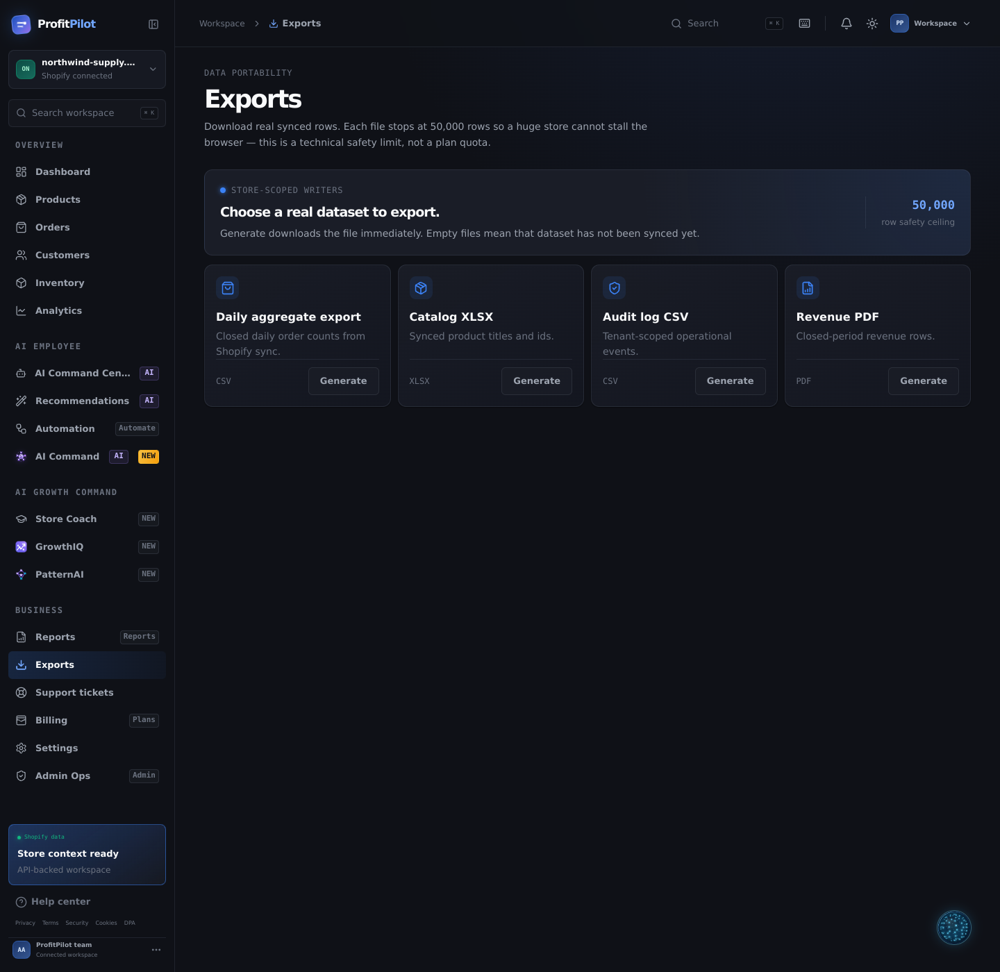
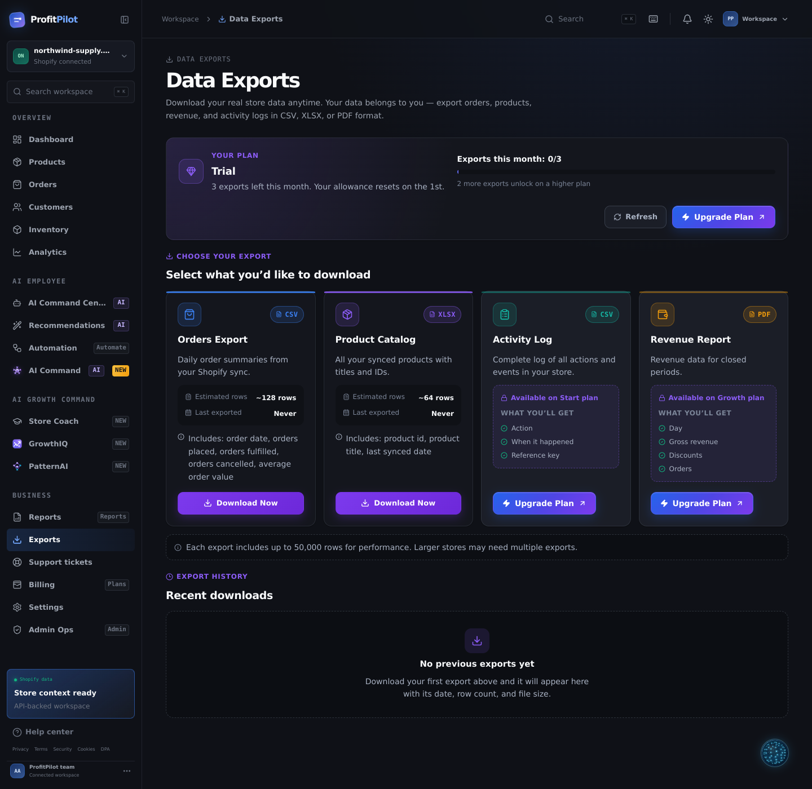
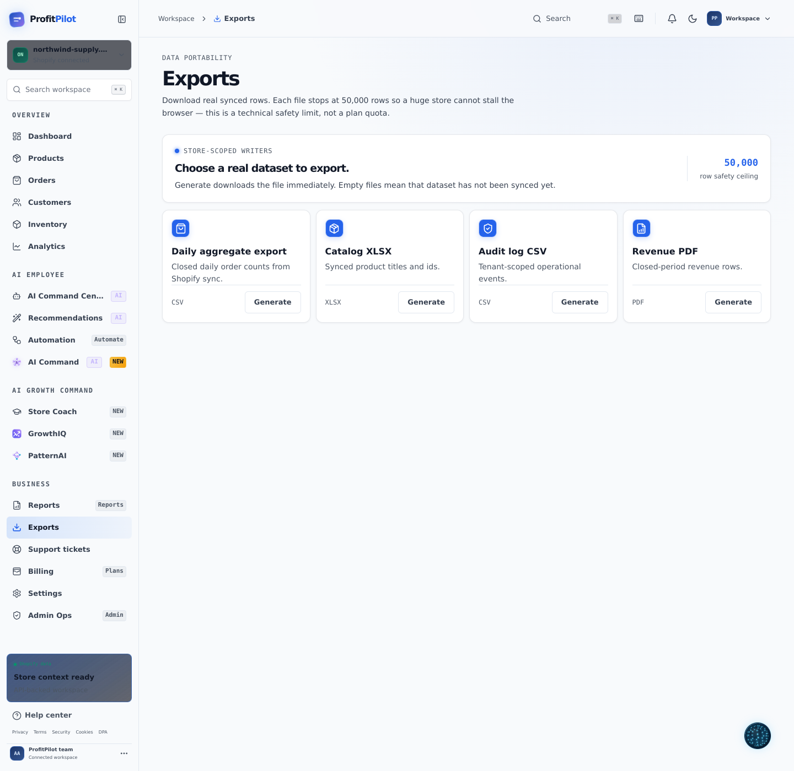
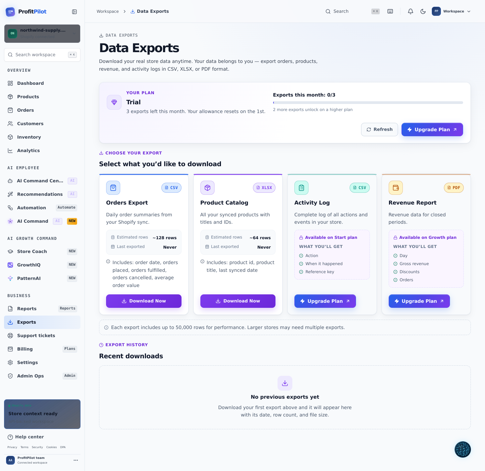

# Exports Page — Professional Redesign + Plan Gating + Complete Testing

Rebuilds the Exports page as a merchant-facing download centre: human names, plan-based
access, real per-card detail, export history, and two finished themes. **Exports page
only** — no other module is touched.

Along the way, testing the actual downloaded files surfaced **two pre-existing bugs that
shipped broken files to merchants**. Both are fixed with regression tests.

📄 Full testing report: [`EXPORTS_FUNCTIONAL_TEST_REPORT.md`](./EXPORTS_FUNCTIONAL_TEST_REPORT.md)

---

## Before → After

| | Before | After |
|---|---|---|
| Dark |  |  |
| Light |  |  |

Growth plan (everything unlocked, unlimited exports, populated history):
[dark](docs/screenshots/exports/after-growth-dark.png) ·
[light](docs/screenshots/exports/after-growth-light.png)

---

## FIX 1 — Professional redesign

- **"DATA PORTABILITY" → "Data Exports"**, with "Download your real store data anytime.
  Your data belongs to you — export orders, products, revenue, and activity logs in CSV,
  XLSX, or PDF format."
- **"STORE-SCOPED WRITERS" panel removed** entirely.
- **The scary "50,000 row safety ceiling" is gone from the hero.** It is now a small note
  under the cards: *"Each export includes up to 50,000 rows for performance. Larger
  stores may need multiple exports."*
- Every name and description rewritten for merchants:

| Before | After |
|---|---|
| Daily aggregate export — "Closed daily order counts from Shopify sync" | **Orders Export** — "Daily order summaries from your Shopify sync" |
| Catalog XLSX — "Synced product titles and ids" | **Product Catalog** — "All your synced products with titles and IDs" |
| Audit log CSV — "Tenant-scoped operational events" | **Activity Log** — "Complete log of all actions and events in your store" |
| Revenue PDF — "Closed-period revenue rows" | **Revenue Report** — "Revenue data for closed periods" |
| "Generate" | **"Download Now"** |

A test asserts none of the old jargon can reappear on the page.

## FIX 2 — Plan-based export access

| Feature | Trial | Start | Growth | Commander |
|---------|-------|-------|--------|-----------|
| Orders CSV | ✅ | ✅ | ✅ | ✅ |
| Product Catalog XLSX | ✅ | ✅ | ✅ | ✅ |
| Activity Log CSV | ❌ | ✅ | ✅ | ✅ |
| Revenue PDF | ❌ | ❌ | ✅ | ✅ |
| Exports per month | 3 | 10 | Unlimited | Unlimited |
| Custom date range | ❌ | ❌ | ✅ | ✅ |
| Scheduled exports | ❌ | ❌ | ❌ | ✅ |

- One shared source of truth (`packages/types/src/exports.ts`) drives both the API and
  the UI, so the screen can never promise something the server refuses.
- Enforced **server-side before any data is read** — a locked merchant never triggers a
  query they cannot download.
- Plan banner shows the real counter: *"💎 Your Plan: Trial · Exports this month: 1/3"*
  with the remaining allowance and an **Upgrade Plan** button.
- Locked cards show a lock badge, "Available on Start plan", a **preview of what they'd
  get**, and only an **Upgrade Plan** button — never a dead download control.
- Hitting the monthly limit explains it in place and refreshes the banner. The merchant
  keeps their place and decides when to upgrade.

## FIX 3 — Enhanced export cards

Each card now carries a themed icon, format badge, **real row estimate**, **last exported
date**, what's included, a prominent Download button with a loading state, and a success
confirmation. Hover lift, per-dataset accent colour, and a disabled "Nothing to export
yet" state when a dataset has no synced rows.

## FIX 4 — Export history

New `export_history` table (migration `0026`, tenant-scoped with RLS) records every
successful download. It powers the monthly counter, the per-card "Last exported" line,
and a **Recent downloads** list showing date, row count, and file size — with a friendly
empty state before the first export.

## FIX 5 — Both themes professional

A scoped `--dx-*` token system drives both themes from one place; no global token is
touched. Light uses the requested `#F8FAFC` canvas, `#FFFFFF` cards with real borders and
layered shadows, `#0F172A` text, and `#7C3AED` download buttons. Dark gets `#14161D`
cards, clearer borders, brighter format badges, and per-dataset accents. Nothing renders
below 12px and `prefers-reduced-motion` is respected.

## FIX 6 — Complete testing

```
Test Files  189 passed (189)
     Tests  2372 passed (2372)
```

**82 new tests.** Beyond unit coverage, the page was driven in a real Chromium browser
against a live dev server in both themes and across all four plans: downloads were
captured, files opened with independent parsers, the Trial limit was exhausted, and the
Upgrade Plan button was followed to Billing. Console errors: none.

---

## 🐞 Bugs fixed

### 1. XLSX downloads could not be opened (critical, pre-existing)

The ZIP writer emitted a 26-byte local header and 40-byte central directory record
instead of the spec's 30 and 46 — the DOS time/date fields were missing and the
flag/method pair was transposed, so every subsequent field was misread.

```
zipfile.BadZipFile: Bad magic number for central directory
```

Excel, Numbers, LibreOffice and Python all rejected the Product Catalog file. Fixed with
spec-correct headers, annotated offsets, and deterministic timestamps.

### 2. PDF put every row on one overflowing line (critical, pre-existing)

`writePdf` joined all rows into a single string separated by a literal `\n`, which PDF
does not treat as a line break. A 90-day Revenue Report rendered as one line running off
the page. Fixed with one positioned text run per row plus automatic pagination
(140 rows → 3 pages, "Page 1 of 3" footer).

### 3. Plan block navigated the merchant away mid-task

A 402 auto-redirected to Billing, losing the merchant's place. Now explained in place.

Also corrected: a 3 + 1 orphan card layout at laptop widths, and a wrapping
"Last exported" label.

---

## ✅ Success criteria

| Criterion | Status |
|---|---|
| Professional redesign (merchant-friendly) | ✅ |
| Human-readable names (not technical) | ✅ |
| Plan-based export access | ✅ enforced server-side |
| Better card design with details | ✅ rows, last exported, includes |
| Export history section | ✅ durable, tenant-scoped |
| All 4 exports work correctly | ✅ verified in a real browser |
| Downloaded files contain real data | ✅ opened with independent parsers |
| Both themes professional | ✅ |
| All bugs fixed | ✅ 3 fixed, 2 with regression tests |
| Zero fake data | ✅ |
| "Upgrade Plan" always | ✅ asserted by test |
| All tests pass | ✅ 2372/2372 |
